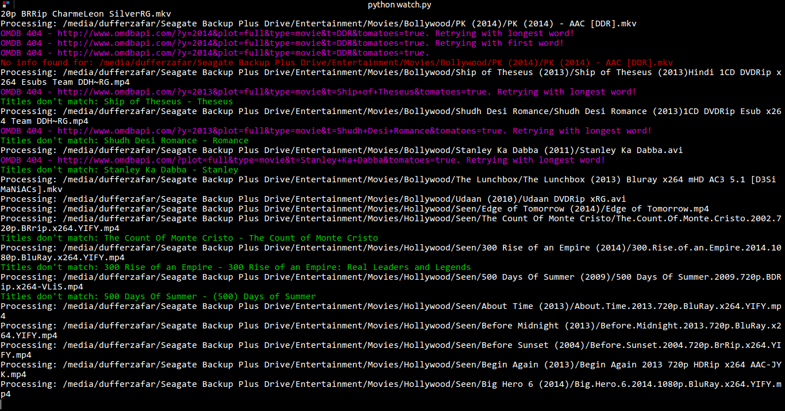

# What to watch?

I have a whole lot of unwatched movies, and deciding what to watch is not an easy thing to do.

Let's automate!

*Currently, It only scans folders for movies, fetches their data from the OMDB API, and saves the json files in a folder. I then use some `jq` magic to filter out movies. I'll probably code something custom that allows you to better filter out movies.*

# Usage

Copy the sample config file: `cp config.py.example config.py`

Add your movie folder paths to the `PATHS` list in config file.

Run `python watch.py`

# Todo

* A Custom Filter Tool
  * Takes in parameters like rating, genre, actors etc.
  * Lists out the best OR top-n matches

*Currentl I do stuff like: `jq ". | select(.imdb_rating != \"N/A\") | select(.imdb_rating | tonumber >= 8.0) | .title, .imdb_rating" < *.json`*

* This can seriously become a movie database 'tagger' like Picard - all it needs is a sleek GUI.

* Errors can be handled by using searching rather than the top result, it'll require some human intervention though.

* We might need to get back to the omdb package if we need to add searching etc back.
